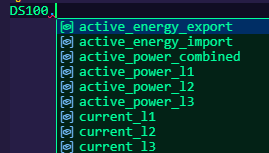

# bgetech_modbus

A asynchronous Modbus library for B+G e-tech energy meters.

## Usage

Here is a simple example, how to use this lib.
In general there are only a few simple steps:

- create an instance
- connect
- build a list with all parameters you want to read from the meter
- call the `read_data()` method

```python
import asyncio

from bgetech_modbus.client import BGEtechClient
from bgetech_modbus.devices import DS100, PM100


async def main():
    # DS100 Client
    client_ds100 = BGEtechClient(host="127.0.0.1", port=502, device_id=1)
    await client_ds100.connect()

    config_ds100 = [DS100.active_energy_import, DS100.active_energy_export]
    data_ds100 = await client_ds100.read_data(config_ds100)

    for entry in data_ds100:
        print(f"{entry.name}: {entry.value} {entry.unit}")
        print(f"Last received: {entry.last_received}")
        print(f"[{entry.address}, {entry.count}, {entry.data_type.value}]")
        print()

    client_ds100.close()

    # PM100 Client (example with different device_id)
    client_pm100 = BGEtechClient(host="127.0.0.1", port=502, device_id=2)
    await client_pm100.connect()

    config_pm100 = [PM100.active_energy_import, PM100.power_factor]
    data_pm100 = await client_pm100.read_data(config_pm100)

    for entry in data_pm100:
        print(f"{entry.name}: {entry.value} {entry.unit}")
        print(f"Last received: {entry.last_received}")
        print(f"[{entry.address}, {entry.count}, {entry.data_type.value}]")
        print()

    client_pm100.close()


if __name__ == "__main__":
    try:
        asyncio.run(main())
    except KeyboardInterrupt:
        print("\nExit!")

```

VS Code or any other IDE will show you the possible values that can be retrieved:



## Adding a New Device

To add support for a new device:

1. Copy `bgetech_modbus/devices/template.py` to `bgetech_modbus/devices/<your_device>.py`
2. Rename the class to match your device (e.g., `class MyDevice:`)
3. Adjust register addresses, scales, and units as needed
4. Add your device to `bgetech_modbus/devices/__init__.py`:
   ```python
   from .<your_device> import MyDevice
   __all__.append('MyDevice')
   ```
5. Import and use in your code:
   ```python
   from bgetech_modbus.devices import MyDevice
   config = [MyDevice.active_energy_import, MyDevice.voltage_l1_n]
   ```

See `bgetech_modbus/devices/pm100.py` for an example implementation.